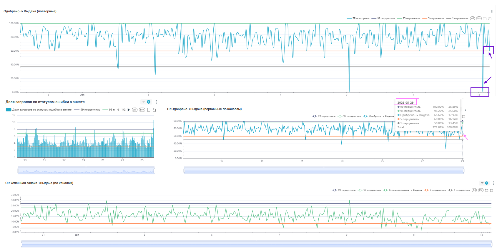

# Real-time мониторинг аномалий (ClickHouse+Superset)

## ⛳️Суть проекта
Система скользящих окон для моментального выявления сбоев и деградации конверсий в кредитной воронке финтех-платформы.

## 🏌🏼‍♀️Техническая логика 
(в файле query_analytics.sql)
* **Детекция аномалий:** расчет границ нормы через квантили `quantile(0.01)` по историческим данным для авто-подсветки отклонений текущего часа в BI.
* **Слой Data Quality (база QE/L2):** оперативный мониторинг доли ошибок в анкетах и парсинг JSON-логов платежных шлюзов напрямую в SQL.
* **Fan-out Protection:** предварительная агрегация метрик по маркетинговым каналам внутри CTE до `LEFT JOIN` для защиты от раздувания данных.
* **Очистка данных:** автоматическое отсечение ботов и flickering-эффекта (исключение юзеров с пересечением групп А/Б).

## ⭐️Бизнес-ценность решения
* **MTTD < 5 минут:** обнаружение технических сбоев и ошибок в анкетах сокращено с нескольких часов до пары минут.
* **0% падений BI:** перенос расчетов в ClickHouse устранил зависания дашбордов в пиковые часы нагрузки.
* **Авто-контроль аномалий:** наложение перцентилей исключило ручную сверку и человеческий фактор при поиске просадок воронки.
